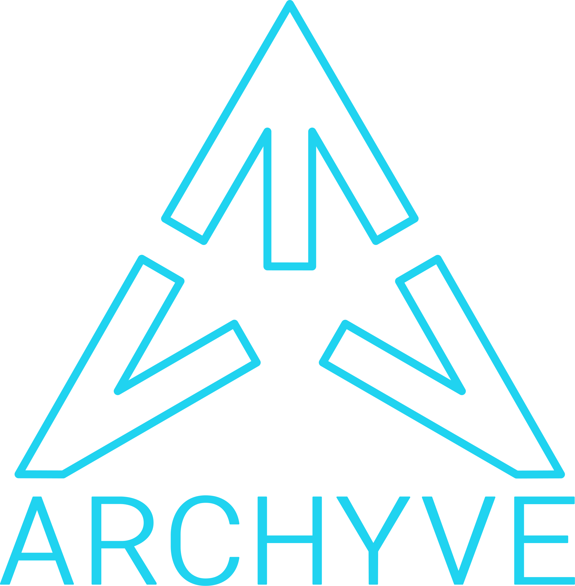

# README

Archyve is a web app that makes pretrained LLMs aware of a user's documents, while keeping those documents on the user's own devices and infrastructure.



## Overview

Archyve enables Retrieval-Augmented Generation (RAG) by providing an API to query the user's docs for relevant context. The client provides the prompt the user gave, and Archyve will return relevant text chunks.

Archyve provides:

- a document upload and indexing UI, where the user can upload documents and test similarity searches against them
- a built-in LLM chat UI, so the user can test the effectiveness of their documents with an LLM
- an API, so the user can provide Archyve search results in dedicated LLM chat UIs

## Getting started

### Dependencies

1. On a Mac ensure you have [brew](https://brew.sh) installed
2. Make sure you have `podman` or `docker` setup and a "machine" configured and ready to pull and run container images.
3. Ensure you have [ops](https://github.com/nickthecook/crops?tab=readme-ov-file#installation) installed

### Develop

To start working / developing with Archyve locally, assuming dependencies are good:

1. Install [Ollama](https://ollama.com/) and make sure you're running `ollama serve` and that you have the minimum models installed (see section on Ollama further below).
2. Clone this repo
3. `ops up`
4. `ops rails db:setup`
5. `ops rails server`
6. Go to `http://127.0.0.1:3300/` and you can login using `admin@archyve.io` and `password` to get started.

### Build

To run Archyve, use `docker compose` or `podman compose`.

1. Clone this repo
2. `cp dotenv_template local.env`
3. Run `openssl rand -hex 64` and put the value in the `SECRET_KEY_BASE` variable in your `local.env` file
4. Run the container

```bash
docker compose up --build
```

> If you see "✘ archyve-worker Error", don't worry about it. Docker will build the image and run it.

5. get a shell in the Archyve container with `docker compose exec archyve bash`
6. run `bin/rails db:encryption:init` from within the container:

```bash
$ rails db:encryption:init
Running `bin/rails db:encryption:init` in environment 'dev'...
Add this entry to the credentials of the target environment:

active_record_encryption:
  primary_key: PqxwHUF2E3MnPUW3qmOHUikIWJxhvY90
  deterministic_key: wJi0qI8KftvGhqkNh42SaG2oh64ZKIGZ
  key_derivation_salt: sE2nd5xn1rq2YdkDHHxQOuDhcOMfV5jr
```

7. put the values from the output into your `local.env` file

```bash
...
ACTIVE_RECORD_ENCRYPTION="{
  \"primary_key\": \"PqxwHUF2E3MnPUW3qmOHUikIWJxhvY90\",
  \"deterministic_key\": \"wJi0qI8KftvGhqkNh42SaG2oh64ZKIGZ\",
  \"key_derivation_salt\": \"sE2nd5xn1rq2YdkDHHxQOuDhcOMfV5jr\"
}"
```

8. Restart the containers
9. Browse to http://127.0.0.1:3300 and log in with `admin@archyve.io` / `password` (you can change these values by setting `USERNAME` and `PASSWORD` in your `local.env` file and restarting the container)

## API

### Authentication

Archyve provides a ReST API. To use it, you must have:

1. a Client ID (goes in the `X-Client-Id` header in all API requests)
2. an API key (goes in the `Authorization` header after `Bearer `)

> Ensure you have set up `ACTIVE_RECORD_ENCRYPTION` as described above!

_TODO: add this to the UI_

If you are running the app on your host, you can set the `DEFAULT_API_KEY` and `DEFAULT_CLIENT_ID` environment variables. On startup, Archyve will ensure that a client with these credentials exists.

- `DEFAULT_API_KEY` must be a 48-byte value encoded in base64. Generate a key with `openssl rand -base64 48`.
- `DEFAULT_CLIENT_ID` can be any string, but it should be unique to your app. A UUID is recommended.

> If you are running the app via `docker compose` or `podman compose`, set the above two environment variables in your `local.env` file and restart the containers.

> If you are running the app on your host, set the two above environment variables and run `rails db:seed`.

#### Sending authenticated requests

You should be able to send API requests like this:

```sh
curl -v localhost:3300/v1/collections \
  -H "Accept: application/json" \
  -H "Authorization: Bearer <YOUR_API_KEY>" \
  -H "X-Client-Id: <YOUR_CLIENT_ID>"
```

See [archyve.io](https://archyve.io) for more information on the API.

See the next section for setting up Ollama for use by Archyve or **document uploads and chat will fail**.

## Dependencies

### Ollama

> You can run a dedicated instance of Ollama in a container by adding it to the `compose.yaml` file, but it takes a while to pull a chat model, so the default here is to assume you already have an Ollama instance.

Archyve will use a local instance of [Ollama](https://ollama.com/) by default. Ensure you have Ollama installed and running (with `ollama serve`) and then run the following commands to set up your Ollama instance for Archyve:

- fast embedding model: `ollama pull all-minilm`
- better embedding model: `ollama pull nomic-embed-text`
- chat model: `ollama pull mistral:instruct`
- alternative chat model: `ollama pull gemma:7b` (if you intend to use Gemma)

### Embedding models

You can select an embedding model separately for each Collection you create inside Archyve.

To make an embedding model available for use in Archyve, go to the ModelConfig page in the [admin UI](http://127.0.0.1:3300/admin), create a new ModelConfig, and set `embedding` to `true`. The new embedding model should be an option when creating a Collection, or viewing a Collection which has no Documents in it.

Make sure you pull the model in Ollama.

### Summarization model

You can change summarization model by changing `SUMMARIZATION_ENDPOINT` and `SUMMARIZATION_MODEL` in your `local.env` file and restarting the server. If you change these values, make sure the new models are present in Ollama.

## Admin UI

There is an admin UI running at http://127.0.0.1:3300/admin. There, you can view and change ModelConfigs and ModelServers if you are logged in as an admin.

There is a link to it in the bottom of the side bar.

## Jobs

Archyve uses a jobs framework called Sidekiq. It has a web UI that you can access at http://127.0.0.1/sidekiq if you are logged in as an admin.
