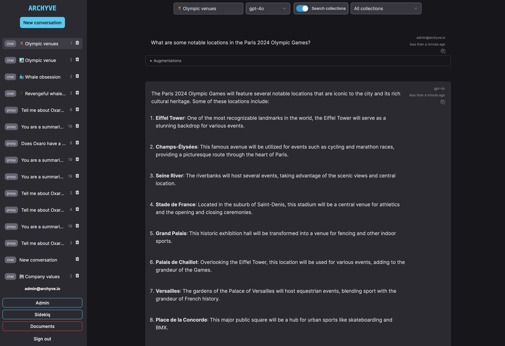
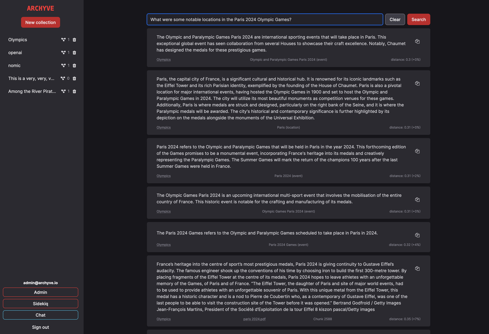
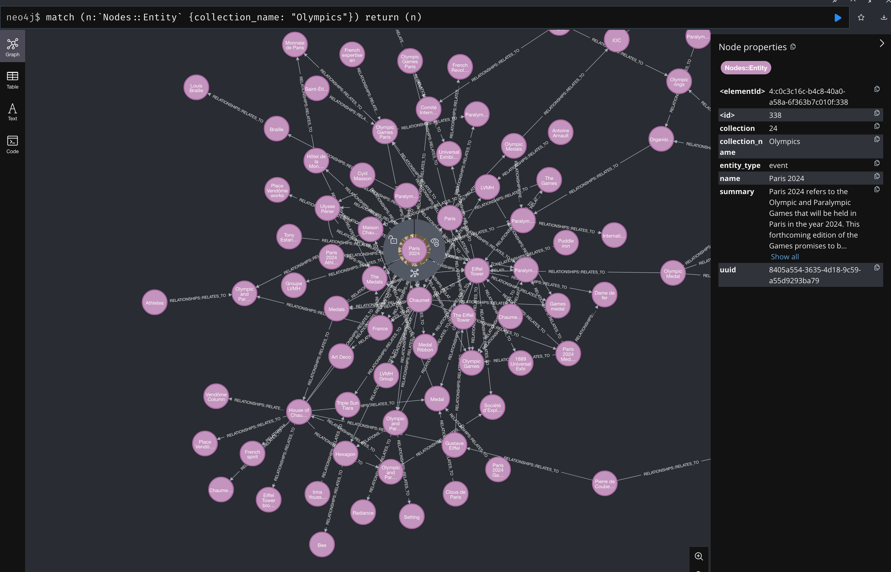

# README

Archyve is a web app that makes pretrained LLMs aware of a user's documents, while keeping those documents on the user's own devices and infrastructure.

## Feature Tracker

Features go through these phases:

- 🚧 **In Development** (some of it might work)
- 🧪 **Experimental** (mostly functional, but results might not be great)
- ✅ **Stable** (expect it to do a decent job)

| **RAG**   | **KnowledgeGraph** | **OpenAI Support** | [**Ollama/OpenAI Proxy Port**](docs/augmenting_proxies.md) |
| --------- | ------------------ | ------------------ | ---------------------------------------------------------- |
| ✅ Stable | 🧪 Experimental    | ✅ Stable          | 🚧 In Development                                          |

## Overview

Archyve enables Retrieval-Augmented Generation (RAG) by providing an API to query the user's docs for relevant context. The Archyve client provides Archyve with the prompt the user entered, and Archyve will return relevant text chunks that the client can include in its prompt to an LLM server.

Archyve has an **experimental** Knowledge Graph feature (a.k.a "Graph RAG").

Archyve provides:

- a document upload and ingest UI, where the user can upload documents and test similarity searches against them
- a built-in LLM chat UI, so the user can test the effectiveness of their documents with an LLM
- an API, so the user can provide Archyve search results in dedicated LLM chat UIs

For LLM servers, Archyve supports:

- **Ollama**
- **OpenAI** (including the Azure variant)

The Getting Started section will walk you through setting up Archyve for use with Ollama.

## Screenshots

### Chat UI



### Documents UI



### Graph database view



## Concepts

- **Collections** are collections of documents that the user can search; use a separate Collection for each subject you want your LLM server to handle questions about
- The **Knowledge Graph** is an in-progress feature of Archyve that extracts entities and relationships from documents, generates summaries of entities, and then provides those summaries as context for LLM prompts.
- **Model Servers** are LLM servers; Archyve can be configured to know about multiple Model Servers, and an admin can switch Archyve from one Model Server to another at runtime
- The **Admin UI** is a portion of the Archyve web interface that is only available to Users with the `admin` attribute set to `true`; you can break things in there, but right now that is the way to configure settings that control Archyve's behaviour

## Getting started

### Running an Archyve container

To run Archyve, use `docker compose`.

> Podman compose will work as well, if you edit the compose file so that Archyve can connect to ollama on `localhost`.

1. Clone this repo
2. `cp dotenv_template local.env`
3. Run `openssl rand -hex 64` and put the value in the `SECRET_KEY_BASE` variable in your `local.env` file
4. Run the container

```bash
docker compose up --build
```

> If you see "✘ archyve-worker Error", don't worry about it. Docker will build the image and run it.

> If you see an error like "**failed to solve: error from sender: open /home/.../archyve/deps/postgres: permission denied**", it's because [Docker has a bug on linux](https://github.com/docker/cli/issues/3043) where it will still try to traverse directories under the build dir even if they're in the `.dockerignore` file.
>
> Work around this with `mv deps ../archyve-deps`. You'll need to `mv ../archyve-deps deps` when you want to run the app on your host again.

5. Browse to http://127.0.0.1:3300 and log in with `admin@archyve.io` / `password` (you can change these values by setting `USERNAME` and `PASSWORD` in your `local.env` file and restarting the container)

> **WARNING**: The container will write a file with local encryption keys into `config/local`. **If you lose this file**, the application will not be able to decrypt sensitive data within the database (e.g. passwords or API keys), and the database will need to be reset, **losing all data**.
>
> If you want to migrate your database elsewhere, migrate this file along with it.

### Running Archyve directly on your host machine

This section is about running Archyve directly on your host machine.

If you want to develop Archyve you probably want the app runing directly on your host, rather than in a container, to reduce the time it takes to try your changes.

#### Installing dependencies on a Mac

1. Ensure that you have [brew](https://brew.sh) installed
2. Ensure that you have `docker` set up and a "machine" configured and ready to pull and run container images

> You can use Docker Desktop, Podman Machine, Rancher Desktop, or anything else that provides OCI capability.
> The `compose.yml` file in this repo assumes you're using Docker, but the only difference when using Podman is that you may need to use different YAML to make your Ollama port on the host available to the containers.

3. Ensure you have [ops](https://github.com/nickthecook/crops?tab=readme-ov-file#installation) installed:

`brew install nickthecook/crops/ops`

4. Install [Ollama](https://ollama.com/) and make sure you're running `ollama serve` and that you have the minimum models installed (see section on Ollama further below).

#### Installing dependencies on Linux

1. Ensure that you have Docker or Podman and the appropriate `compose` plugins installed
2. Ensure you have [ops](https://github.com/nickthecook/crops?tab=readme-ov-file#installation) installed (download the binary for your platform).
3. Install [Ollama](https://ollama.com/) and make sure you're running `ollama serve` and that you have the minimum models installed (see section on Ollama further below).

#### Running Archyve

1. Clone this repo
2. `cp config/dev/config.sample.json config/dev/config.json`
3. Edit `config/dev/config.json`, running the given commands and replacing them in the file with their output

- only put secrets in this file for dev - use `config/dev/secrets.ejson` for any real environment
- you can change the auto-configured models here if you want; model "name" is for display in Archyve, model "model" is what is sent to the LLM server when making a request
- you must have at least one model with `embedding: true` and one without `embedding` set (or `embedding: false`)

4. `ops up`
5. `ops rails db:setup` (after the initial setup)
6. `ops rails neo4j:migrate`
7. `ops server`
8. Open `http://127.0.0.1:3300/` in a browser and you can login using `admin@archyve.io` and `password`.

> `ops` loads environment variables from `config/dev/config.json` and `config/dev/secrets.ejson`. It loads actions and dependencies from `ops.yml` in your working directory. It will save you time.
>
> You may want to `alias rails="ops rails"` if you're a Rails dev, and the `rails ...` muscle memory is hard to change.

There are [more details](docs/deploying.md) on how to deploy Archyve to production.

## Using Archyve

Archyve provides a web interface with a few different areas, focused on different things:

- **Documents** (the default page when logged in) allows you to upload, process, and test searching your document collections
- **Chat** lets you chat with an LLM, using Archyve's prompt augmentation to pull relevant information from your document collections
- **Admin** is available only to Users with the `admin` attribute set to `true`, and allows admins to manage all aspects of Archyve

> You can **break things** in the admin UI. When starting out, it's best just to use it to configure ModelServers, ModelConfigs, and Settings.

- **Sidekiq** shows the interface for managing background jobs

### Document ingest

Documents uploaded to any Collection go through a few stages:

1. Chunking (splitting the document into chunks of 1000 characters)
2. Embedding (vectorizing the chunks using an embedding model)
3. Storing in the vector database (ChromaDB)

If a stage takes longer than a second, the progress is shown in the UI. Once a document is in the `Embedded` state, you can test searching it to see what chunks would be returned for a given chat prompt.

When the Collection has the Knowledge Graph feature enabled, Documents also go through:

4. Entity extraction (having an LLM identify entities and relationships from the text)

Then the Collection will go through a few stages:

5. Entity summarization (creating a summary for each entity based on references found in the text during stage 4)
6. Vectorization (vectorizing the summary using an embedding model and storing in ChromaDB)
7. Graphing (pushing entities and relationships to Neo4j)

### Viewing extracted entities

Once you have a document in the `Extracted` state, you can view the most commonly references entities that were extracted from Documents in a Collection. Click the "Top 10 entities by occurrences" tab on the Collection page to see the 10 entities in that Collection that appeared more often in Documents than any others.

> Relationships are not yet visible in the Archyve UI, although you are presented with a count of the number of relationships each entity has.

### Viewing the Knowledge Graph

Once you have a Collection in the `Graphed` state, you can view the knowledge graph in the Neo4j web interface:

- http://localhost:7474 (credentials are neo4j/password by default)

You can query the graph using Cypher queries. E.g., for a Collection called "Greek Mythology", use this query to show the complete graph, with all relationships:

`match (n:`Nodes::Entity` {collection_name: "Greek Mythology"}) return (n)`

> Archyve doesn't do anything with data once it's in Neo4j, but it will, and the Neo4j interface can be useful in assessing the quality of entity extraction.

## API

> See [archyve.io](https://archyve.io) for details on the ReST API.

### Authentication

Archyve provides a ReST API. To use it, you must have:

1. a Client ID (goes in the `X-Client-Id` header in all API requests)
2. an API key (goes in the `Authorization` header after `Bearer `)

_TODO: add this to the UI_

If you are running the app on your host, you can set the `DEFAULT_API_KEY` and `DEFAULT_CLIENT_ID` environment variables. On startup, Archyve will ensure that a client with these credentials exists in its database.

- `DEFAULT_API_KEY` must be a 48-byte value encoded in base64. Generate a key with `openssl rand -base64 48`.
- `DEFAULT_CLIENT_ID` can be any string, but it should be unique to your app. A UUID is recommended.

> If you are running the app via `docker compose` or `podman compose`, set the above two environment variables in your `local.env` file and restart the containers.

> If you are running the app on your host, set the two above environment variables in `config/dev/config.json` and run `rails db:seed`.

#### Sending authenticated requests

You should be able to send API requests like this:

```sh
curl -v localhost:3300/v1/collections \
  -H "Accept: application/json" \
  -H "Authorization: Bearer <YOUR_API_KEY>" \
  -H "X-Client-Id: <YOUR_CLIENT_ID>"
```

See [archyve.io](https://archyve.io) for more information on the API.

See the next section for setting up Ollama for use by Archyve or **document uploads and chat will fail**.

If you are running Archyve directly on your host, you will have `ops` set up and you can use `ops request` to send requests to the Archyve API. E.g.:

```shell
$ ops request search `q=hello`
$ ops request collections/1/entities/1
$ ops request version
```

It will handle setting the authorization header for you.

## Dependency details

### Ollama

> You can run a dedicated instance of Ollama in a container by adding it to the `compose.yaml` file, but it takes a while to pull a chat model, so the default here is to assume you already have an Ollama instance.

Archyve will use a local instance of [Ollama](https://ollama.com/) by default. Ensure you have Ollama installed and running (with `ollama serve`) and then run the following commands to set up your Ollama instance for Archyve:

- embedding model: `ollama pull nomic-embed-text`
- chat model: `ollama pull llama3.1:8b`
- chat summarization model: `ollama pull phi3:latest`

You can change which models Archyve will use in the Admin UI (`/admin`) under Settings in the menu on the left.

> Keep in mind that whatever models you have Archyve use, you will need to pull those models in Ollama yourself (for now).

### Embedding model

Archyve uses the `nomic-embed-text` model for all embeddings. Please make sure it is present in your Ollama server.

> Changing the embedding model means you will **need to delete all your Collections** and re-ingest them, as all the embeddings will have changed and similarity search will not function.
> Archyve has not been testing with embedding models other than `nomic-embed-text`.

### Summarization model

The summarization model is the model Archyve will use to summarize chats so it can set a brief title for each one, based on the first message in the chat.

`phi3` is fast and usually decent at this, but you can change this model in the Admin UI (`/admin`) under Settings -> "summarization_model".

### Entity extraction model

If you enable the Knowledge Graph for any Collections, Archyve will default to using `llama3.1:8b` as the entity extraction model. If you change this, you may get poor results from the KG. However, I'd be very interested to hear your experience if you do try another model!

### OpenAI

Archyve works with OpenAI, but you need to provision one ModelServer and one ModelConfig first.

#### ModelServer

Go to "Admin" using the button in the bottom left, then click "ModelServers". Click the "+" in the top right of the ModelServer list and enter this info:

- Name: `OpenAI` (or whatever you want)
- URL: `https://api.openai.com/v1`
- Provider: `openai`
- Api key: `sk-<the rest of your OpenAI API key>`

Click "Save".

#### ModelConfig

From the Admin UI, click ModelConfigs on the left. Click the "+" in the top right of ModelConfig list and enter this info:

- ModelServer: select "OpenAI" from the list (or whatever you named your ModelServer above)
- Name: OpenAI GPT-4o (or whatever you want)
- Model: `gpt-4o` (or any valid OpenAI model you can chat with - see [here](https://platform.openai.com/docs/models/model-endpoint-compatibility) for a list)
- Temperature: 0.1 (or whatever you want)

Leave "Embedding" unchecked - this is not an embedding model. Click "Save".

You can now select this Model from the drop-down in a Conversation. To make this your default generation model, go to the ModelConfigs list in the Admin UI, click the three dots menu on the right side of your model config, then click "Use for chat".

#### OpenAI embeddings

These are not supported at the moment. Archyve needs to support the OpenAI embedding response format, and it needs to make it easy for users to use multiple embedding models at the same time, and make it clear what the limitations are of doing that.

### Azure OpenAI

Archyve works with OpenAI, but you need to provision one ModelServer and one ModelConfig first.

#### ModelServer

Go to "Admin" using the button in the bottom left, then click "ModelServers". Click the "+" in the top right of the ModelServer list and enter this info:

- Name: `Azure OpenAI` (or whatever you want)
- URL: the endpoint from the Azure portal
- Provider: `openai_azure`
- Api key: the API key from the Azure AI Workshop (or whatever they're calling it these days)

Click "Save".

#### ModelConfig

From the Admin UI, click ModelConfigs on the left. Click the "+" in the top right of ModelConfig list and enter this info:

- ModelServer: select "OpenAI" from the list (or whatever you named your ModelServer above)
- Name: OpenAI GPT-4o (or whatever you want)
- Model: `gpt-4o` (or any valid OpenAI model you can chat with - see [here](https://platform.openai.com/docs/models/model-endpoint-compatibility) for a list)
- Temperature: 0.1 (or whatever you want)

Leave "Embedding" unchecked - this is not an embedding model. Click "Save".

You can now select this Model from the drop-down in a Conversation. To make this your default generation model, go to the ModelConfigs list in the Admin UI, click the three dots menu on the right side of your model config, then click "Use for chat".

#### Azure OpenAI embeddings

These are not supported at the moment. Archyve needs to support the OpenAI embedding response format, and it needs to make it easy for users to use multiple embedding models at the same time, and make it clear what the limitations are of doing that.

## Admin UI

There is an admin UI running at http://127.0.0.1:3300/admin. There, you can view and change Settings, ModelConfigs, and ModelServers if you are logged in as an admin.

There is a link to it in the bottom of the side bar if you are logged into Archyve as an admin.

## Jobs

Archyve uses a jobs framework called Sidekiq. It has a web UI that you can access at http://127.0.0.1/sidekiq if you are logged in as an admin.

## Knowledge Graph

> Archyve uses the term "Knowledge Graph" instead of Graph RAG because "RAG" is ambiguous. Everything is "retrieved" from somwhere.

Archyve has an **experimental** Knowledge Graph (KG) feature (a.k.a. "Graph RAG"). The user enables the feature per-Collection. It is safe to use, but will generate orders of magnitude more calls to your LLM server than not using it.

> If you enable KG in any Collections, it is **highly recommended** that you use `llama3.1` as your `entity_extraction_model`. Many other models are simply not able to extract entities in a meaningful way with the prompts used by Archyve.

This feature is a work-in-progress, but it seems effective at providing relevant context at the moment. It will extract entities and the relationships between those entities from the text of your documents. It will then create a summary of each entity and store that in the vector database. These entity summaries will be returned by Archyve API `search` along with relevant chunks of your document.

If a Collection has KG enabled, chatting with Archyve about that Collection will use the KG to augment your prompts.

Archyve KG is based on Microsoft's [Graph RAG project](https://github.com/microsoft/graphrag). Archyve is as far as extracting entities and relationships from uploaded documents, but does not perform community detection or entity deduplication yet.
