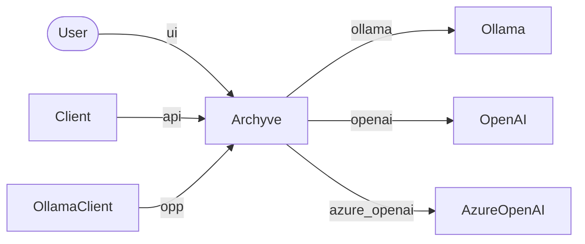

# Integrations

## Clients

Clients use Archyve's API under `/v1` on port 3300.

## Ollama Clients

Ollama Clients include:

- Open WebUI
- Huggingface Chat
- Ollama CLI

## Testing

- User/UI
  - chat with augmentation (manual)
  - chat without augmentation (manual)
  - collection creation with KG (manual)
  - collection creation without KG (manual)
  - document ingest with KG (manual)
  - document ingest without KG (manual)
  - search collection
  - global search
- Client/API
  - all routes (`ops e2e`)
- OllamaClient
  - Ollama CLI list/ps/version/chat (`ops e2e`)
  - Open WebUI chat (going with `ops e2e` unless I find the requests substantially different)
  - Huggingface ChatUI chat (`ops e2e`)
