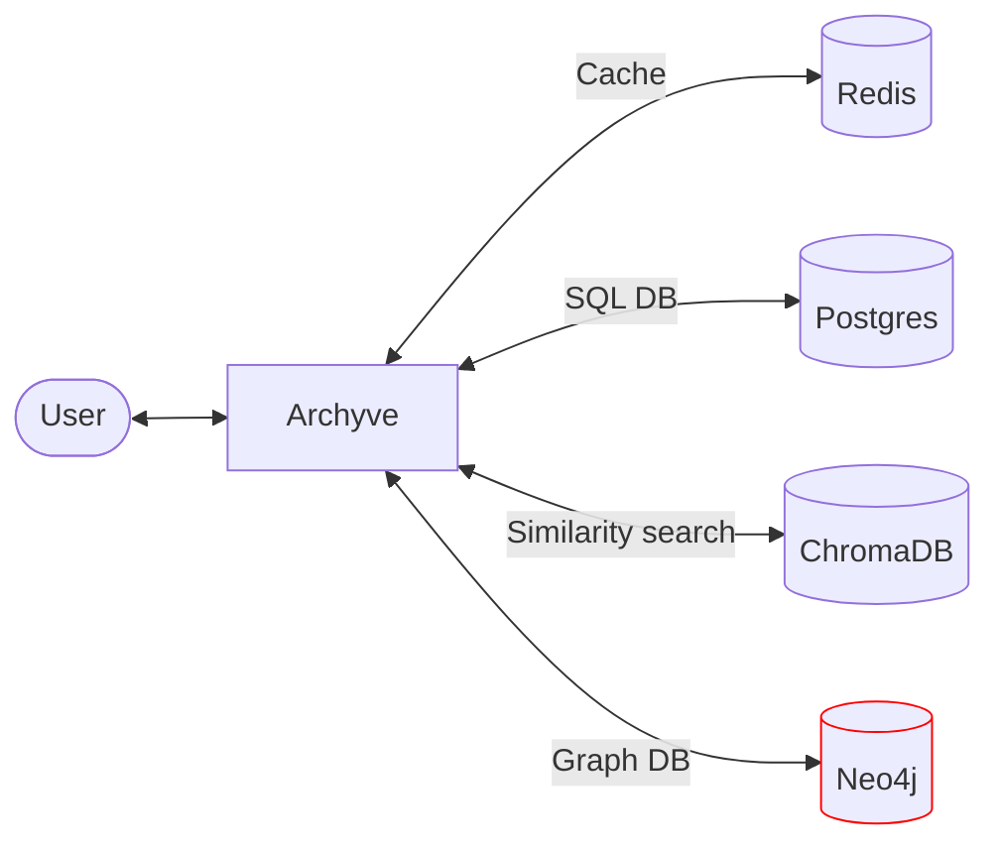

# Knowledge Graph

Archyve's Knowledge Graph feature extract entities from documents the user uploads, summarizes them, identifies groupings of entities, and uses this knowledge of entities and communities to augment chat prompts.

It is based on the work in [Microsoft's Graph RAG project](https://github.com/microsoft/graphrag). The prompts used by Archyve to instruct LLMs to extract entities, summarize descriptions, etc. are all based on prompts from that project.

## System overview

Components and connections added for the Knowledge Graph feature are in red.



## Job pipeline architecture

Archyve is a Rails app that uses the Sidekiq jobs framework.

The ingest pipeline within Archyve follows a pattern:

1. The user performs an action (e.g. uploading a document)
2. Archyve enqueues a job
3. The job runs a Service (from `/app/services`) and optionally enqueues another job

This pattern allows multi-stage job pipelines to process documents and collections, while only retrying any failed jobs instead of starting over.

### Ingest pipeline

Red boxes are Jobs, blue boxes are Services.

```plantuml
digraph ingest_pipeline {
  node [shape=box]
  edge [fontsize=10]

  {
    node [color=red]

    IngestJob ExtractDocumentEntitiesJob SummarizeCollectionJob VectorizeCollectionSummariesJob GraphCollectionJob CleanCollectionEntitiesJob
  }

  {
    node [color=blue]

    TheIngestor ExtractDocumentEntities SummarizeCollectionEntities GraphCollectionEntities

    TheIngestor -> TheIngestor [label="chunk and embed\ndocument content"]
    ExtractDocumentEntities -> ExtractDocumentEntities [label="extracts entity descriptions\nfrom document chunks"]
    SummarizeCollectionEntities -> SummarizeCollectionEntities [label="summarizes entities based\non extracted entity descriptions"]
    CleanCollectionEntities -> CleanCollectionEntities [label="remove dangling entities"]
    VectorizeCollectionSummaries -> VectorizeCollectionSummaries [label="stores entity summaries\nin the vector database"]
    GraphCollectionEntities -> GraphCollectionEntities [label="creates a graph of extracted\nentities and their relationships\nin Neo4j"]
  }

  DocumentsController -> IngestJob [label="  enqueue"]
  IngestJob -> TheIngestor [label="execute"]
  IngestJob -> ExtractDocumentEntitiesJob [label="  enqueue"]
  ExtractDocumentEntitiesJob -> ExtractDocumentEntities [label="execute"]
  ExtractDocumentEntitiesJob -> SummarizeCollectionJob [label="  enqueue"]
  ExtractDocumentEntitiesJob -> CleanCollectionEntitiesJob [label="  enqueue"]
  SummarizeCollectionJob -> SummarizeCollectionEntities [label="execute"]
  SummarizeCollectionJob -> VectorizeCollectionSummariesJob  [label="  enqueue"]
  CleanCollectionEntitiesJob -> CleanCollectionEntities [label="execute"]
  VectorizeCollectionSummariesJob -> VectorizeCollectionSummaries [label="execute"]
  VectorizeCollectionSummariesJob -> GraphCollectionJob  [label="  enqueue"]
  GraphCollectionJob -> GraphCollectionEntities [label="execute"]

  rank=same { IngestJob TheIngestor }
  rank=same { ExtractDocumentEntitiesJob ExtractDocumentEntities }
  rank=same { SummarizeCollectionJob SummarizeCollectionEntities }
  rank=same { GraphCollectionJob GraphCollectionEntities }
  rank=same { VectorizeCollectionSummariesJob VectorizeCollectionSummaries }
  rank=same { CleanCollectionEntitiesJob CleanCollectionEntities }
}
```

## Querying Neo4j

You can query the graph database directly from the Neo4j web UI. It's at [http://localhost:7474](http://localhost:7474) in dev.

To graph all nodes in the database:

```neo4j
match (n) return (n)
```

To graph nodes from one Archyve Collection, called "Greek Mythology":

```neo4j
match (n:`Nodes::Entity` {collection_name: "Greek Mythology"}) return (n)
```

To remove all nodes from the database:

```neo4j
match (n) detach delete (n)
```

To remove nodes from just one Collection:

```neo4j
match (n:`Nodes::Entity` {collection_name: "Greek Mythology"}) detach delete (n)
```
