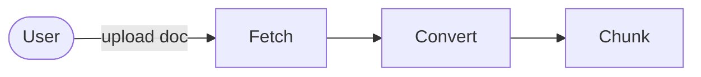

# Mediator

The `Mediator` manages the flow of a document until it is chunked.

## Fetch

If the user specifies a link (URL) then the `Mediator` will kick off the `FetchWebDocumentJob` to download the content and create a file to associate with the document.

## Convert

If the document's content has a format (content type) that requires conversion prior to chunking, then the `Mediator` kicks off the `ConvertDocumentJob`. Here we look up the appropriate converter for the document's format and start the conversion.

## Chunk

If the document's content format is chunk-able, then the `Mediator` kicks off the `ChunkDocumentJob`. Here we look up the appropriate chunker for the document's format and start the chunking.
